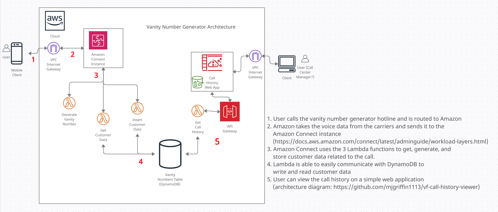
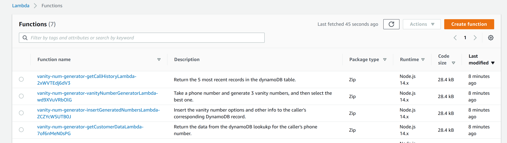

# Vanity Number Generator Serverless Application

## Overview

Welcome. This repository defines and deploys an AWS serverless application which will integrate with Amazon Connect to generate and store
vanity numbers for the customers who call the number generator hotline.

This application is composed of several lambda functions, an API gateway, and a DynamoDB table.



## Build and Deploy

Use `sam build` to build the application.\
Use `sam deploy --guided` to deploy the application.\
(need to select the non-default answer `y` for `getCallHistory may not have authorization defined, Is this okay?`)

Verify that the lambda functions have been created.\
Go to Lambda functions in the AWS Console.\
Function list should look something like this:



Test the functions from the console (if you get `access denied` it is probably because something needs to be updated in the permissions boundary)

## Connect Integration

If you do not have an Amazon Connect instance in your account, you will need to create one.\
Go to Amazon Connect -> Get Started\
Choose your starting settings (ensure outbound and inbound calling are enabled)\
Wait a couple minutes while instance is created

Before you can enter the Amazon Connect portal, go to the Amazon Connect service in the AWS console.\
Click on the instance alias\
Click on Contact Flows (left menu at very bottom)\
Add a lex bot in the Amazon Lex section if you are in a supported region and you have a bot created (will put info below)\
Under AWS Lambda section, add the getCustomerDataLambda, vanityNumberGeneratorLambda, and insertGeneratedNumbersLambda to the instance

Now you can log in to your Amazon Connect portal\
Go to Contact Flows (under Routing on left menu)\
Click Create New Contact Flow -> Import flow (top right)\
Select either Vanity Number Generator No Lex or Vanity Number Generator With Lex .txt file\
(If you did not add Lex in the above step you won't be able to use it here)\
Update the Lambda function blocks to reference the newly created/added Lambda functions\
In order of the call flow, the Lambda functions are getCustomerDataLambda -> vanityNumberGeneratorLambda -> insertGeneratedNumbersLambda\
Save then Publish the Contact Flow

Go to Routing -> Phone Numbers -> Claim Number\
Claim a phone number and link it to the newly created Contact Flow\
Wait a minute for it to get set up, then call the number and get your custom vanity number options

If you want to see the Call History app, go [here](https://github.com/mjgriffin1113/vf-call-history-viewer)

### Deploy Issues and Troubleshooting

The first time I used `sam deploy` the permissions boundary was successfully created. Now I am seeing an error:\
`Scope ARN: arn:aws:iam::345859732721:policy/vanity-num-generator-us-east-2-PermissionsBoundary does not exist or is not attachable. (Service: AmazonIdentityManagement;Status Code: 404; Error Code:`\
To fix this, go to IAM -> Policies -> Create Policy\
Name the policy (eg: vanity-num-generator-us-east-2-PermissionsBoundary)\
Use the example permissions boundary template in public/permissionsBoundary.example.js\
(will need to slightly modify the account number and possibly stack name based on your chosen name)

After creating the policy, if you have a failed deploy in your history, you may need to delete the old stack before deploy will work.\
Go to Cloudformation -> Stacks -> find the stack with the name from the error message:
`Stack:arn:aws:cloudformation:us-east-2:214955311292:stack/vanity-num-generator/11da80e0-c76c-11eb-8e24-0a337b461fd4 is in ROLLBACK_COMPLETE state and can not be updated`\
Delete the stack and re-run the deploy (with defaults is fine, except for the question about get call history authorization)

Verify that the API Gateway and DynamoDB table have also been successfully created/configured with desired properties.

### Amazon Lex

If you want to utilize Lex in the contact flow, then you will need to create a bot using Amazon Lex service\
The bot needs to have two intents and their corresponding utterance list:

- GenerateNewOptions: [too, to, two]
- KeepExistingOptions: [won, one]

Ensure `Return parameters to client` under Fulfillment section is checked for both intents\
Build and publish the bot, and remember to add it to the contact flow settings on the Amazon Connect service (in AWS console, not AC portal)

## Local and Automated Testing

### Integration Testing

Integration tests are stored in `__tests__` folder.\
AWS creds are needed (run `aws configure`).\
Set up test data using the `events` folder.

```
npm install
npm run test
```

### Local Lambda Testing

Use `sam local invoke {{resourceName}} -e {{path/to/event.json}}`

Example commands:

```
sam local invoke insertGeneratedNumbersLambda -e events/AmazonConnectEvent.json
```

## Original Documentation From 'Start from scratch starter project'

(use `sam init` to download the start from scratch starter project sample app)

This project contains source code and supporting files for the serverless application that you created in the AWS Lambda console. You can update your application at any time by committing and pushing changes to your AWS CodeCommit or GitHub repository.

This project includes the following files and folders:

- src - Code for the application's Lambda function.
- \_\_tests__ - Unit tests for the application code.
- template.yml - A SAM template that defines the application's AWS resources.
- buildspec.yml -  A build specification file that tells AWS CodeBuild how to create a deployment package for the function.

Your Lambda application includes two AWS CloudFormation stacks. The first stack creates the pipeline that builds and deploys your application.

For a full list of possible operations, see the [AWS Lambda Applications documentation](https://docs.aws.amazon.com/lambda/latest/dg/deploying-lambda-apps.html).

## Try the application out

1. Go to the Lambda console.
2. Select **Applications** and select the one you created.
3. Select **helloFromLambdaFunction** in the **Resources** table.
4. Create a test event with the default settings. (Select **Select a test event** -> select **Configure test events** -> type in **Event name** -> select **Create**)
5. Select **Test** and you can see the result.

## Add a resource to your application

The application template uses the AWS Serverless Application Model (AWS SAM) to define application resources. AWS SAM is an extension of AWS CloudFormation with a simpler syntax for configuring common serverless application resources, such as functions, triggers, and APIs. For resources that aren't included in the [AWS SAM specification](https://github.com/awslabs/serverless-application-model/blob/master/versions/2016-10-31.md), you can use the standard [AWS CloudFormation resource types](https://docs.aws.amazon.com/AWSCloudFormation/latest/UserGuide/aws-template-resource-type-ref.html).

Update `template.yml` to add a dead-letter queue to your application. In the **Resources** section, add a resource named **MyQueue** with the type **AWS::SQS::Queue**.

```
Resources:
  MyQueue:
    Type: AWS::SQS::Queue
```

The dead-letter queue is a location for Lambda to send events that could not be processed. It's only used if you invoke your function asynchronously, but it's useful here to show how you can modify your application's resources and function configuration.

Commit the change and push.

```bash
my-application$ git commit -am "Add dead-letter queue."
my-application$ git push
```

**To see how the pipeline processes and deploys the change**

1. Open the [**Applications**](https://console.aws.amazon.com/lambda/home#/applications) page.
1. Choose your application.
1. Choose **Deployments**.

When the deployment completes, view the application resources on the **Overview** tab to see the new resource.

## Update the permissions boundary

The sample application applies a **permissions boundary** to its function's execution role. The permissions boundary limits the permissions that you can add to the function's role. Without the boundary, users with write access to the project repository could modify the project template to give the function permission to access resources and services outside of the scope of the sample application.

In order for the function to use the queue that you added in the previous step, you must extend the permissions boundary. The Lambda console detects resources that aren't in the permissions boundary and provides an updated policy that you can use to update it.

**To update the application's permissions boundary**

1. Open the [**Applications**](https://console.aws.amazon.com/lambda/home#/applications) page.
1. Choose your application.
1. Choose **Edit permissions boundary**.
1. Follow the instructions shown to update the boundary to allow access to the new queue.

## Update the function configuration

Now you can grant the function permission to access the queue and configure the dead-letter queue setting.

In the function's properties in `template.yml`, add the **DeadLetterQueue** configuration. Under Policies, add **SQSSendMessagePolicy**. **SQSSendMessagePolicy** is a [policy template](https://docs.aws.amazon.com/serverless-application-model/latest/developerguide/serverless-policy-templates.html) that grants the function permission to send messages to a queue.

```
Resources:
  MyQueue:
    Type: AWS::SQS::Queue
  helloFromLambdaFunction:
    Type: AWS::Serverless::Function
    Properties:
      CodeUri: ./
      Handler: src/handlers/hello-from-lambda.helloFromLambdaHandler
      Runtime: nodejs10.x
      MemorySize: 128
      Timeout: 60
      DeadLetterQueue:
        Type: SQS
        TargetArn: !GetAtt MyQueue.Arn
      Policies:
        - SQSSendMessagePolicy:
            QueueName: !GetAtt MyQueue.QueueName
        - AWSLambdaBasicExecutionRole
```

Commit and push the change. When the deployment completes, view the function in the console to see the updated configuration that specifies the dead-letter queue.

## Build and test locally

The AWS SAM command line interface (CLI) is an extension of the AWS CLI that adds functionality for building and testing Lambda applications. It uses Docker to run your functions in an Amazon Linux environment that matches Lambda. It can also emulate your application's build environment and API.

If you prefer to use an integrated development environment (IDE) to build and test your application, you can use the AWS Toolkit.
The AWS Toolkit is an open-source plugin for popular IDEs that uses the AWS SAM CLI to build and deploy serverless applications on AWS. The AWS Toolkit also adds step-through debugging for Lambda function code.

To get started, see the following:

* [PyCharm](https://docs.aws.amazon.com/toolkit-for-jetbrains/latest/userguide/welcome.html)
* [IntelliJ](https://docs.aws.amazon.com/toolkit-for-jetbrains/latest/userguide/welcome.html)
* [VS Code](https://docs.aws.amazon.com/toolkit-for-vscode/latest/userguide/welcome.html)
* [Visual Studio](https://docs.aws.amazon.com/toolkit-for-visual-studio/latest/user-guide/welcome.html)

To use the AWS SAM CLI with this sample, you need the following tools:

* AWS CLI - [Install the AWS CLI](https://docs.aws.amazon.com/cli/latest/userguide/cli-chap-install.html) and [configure it with your AWS credentials](https://docs.aws.amazon.com/cli/latest/userguide/cli-chap-configure.html).
* AWS SAM CLI - [Install the AWS SAM CLI](https://docs.aws.amazon.com/serverless-application-model/latest/developerguide/serverless-sam-cli-install.html).
* Docker - [Install Docker community edition](https://hub.docker.com/search/?type=edition&offering=community).

Build your application with the `sam build` command.

```bash
my-application$ sam build -m package.json
```

The AWS SAM CLI installs dependencies that are defined in `package.json`, creates a deployment package, and saves its contents in the `.aws-sam/build` folder.

Run functions locally and invoke them with the `sam local invoke` command.

```bash
my-application$ sam local invoke helloFromLambdaFunction --no-event
```

## Unit tests

Requirements:

* Node.js - [Install Node.js 10](https://nodejs.org/en/), including the npm package management tool.

Tests are defined in the \_\_tests__ folder in this project. Use `npm` to install the [Jest test framework](https://jestjs.io/) and run unit tests.

```bash
my-application$ npm install
my-application$ npm run test
```

## Resources

For an introduction to the AWS SAM specification, the AWS SAM CLI, and serverless application concepts, see the [AWS SAM Developer Guide](https://docs.aws.amazon.com/serverless-application-model/latest/developerguide/what-is-sam.html).

Next, you can use the AWS Serverless Application Repository to deploy ready-to-use apps that go beyond Hello World samples and learn how authors developed their applications. For more information, see the [AWS Serverless Application Repository main page](https://aws.amazon.com/serverless/serverlessrepo/) and the [AWS Serverless Application Repository Developer Guide](https://docs.aws.amazon.com/serverlessrepo/latest/devguide/what-is-serverlessrepo.html).
